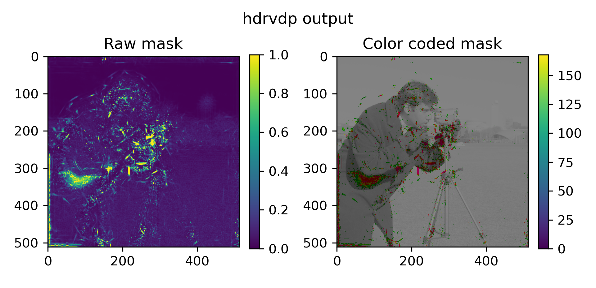
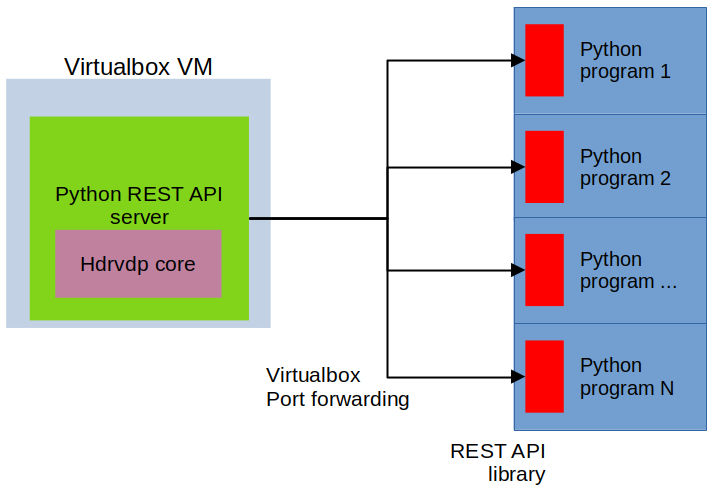

# HDRVDP Python wrapper
A simple Python wrapper for the  HDR-VDP C++ code. *Ubuntu 14* is required (e.g within a Virtualbox virtual machine) as hdrvdp-1.7.1 (the latest C only version) depends on pfstools 1.8.5. 

### Simple usage within the virtual machine
The Python library can be invoked as:

```
from hdrvdpwrap import calchdrvdp
...
out  = calchdrvdp(img1, img2)
```
The program is running within a Virtualbox Ubuntu14 virtual machine (in a conda environment).



*Figure 1: hdrvdp mask output, showing an estimate of the most noticeable differencies within the image.*

A simple demo code is in `hdrvdpwrap.py` and can be used to generate the image in Figure 1. Cameraman and cameraman squared are used as input images.

### Usage outside the virtual machine
By setting up a python server (`test_server.py`) within the virtual machine, one can use the library `test_client.py` (that also serves as a a test code for the library itself) to perform computation in a normal python program, running on a real (modern) machine. The functional scheme  is depticted in Figure 2. Being stateless, virtually many clients can be used at the same time.



*Figure 2: Thanks to the library, a program running on any PC in the network can compute the hdrvdp measure on two images online.*

The usage is straightforward and completely equivalent to an invocation of the simple function:

```
import numpy as np
from skimage import data, img_as_float

from testclient import calchdrvdpremote

img1 = (data.camera()).astype(np.float32)
img2 = (img1**2).astype(np.float32)

url = "http://localhost:8885" # server URL
out = calchdrvdpremote(img1, img2, url=url)
```

On the server side, Flask is used to process the POST requests.

### Setup
This procedure is valid for the server side, or the machine that hosts the hdrvdp C code.
The python wrapper (and so the REST server) requires a working installation of the hdrvdp-1.7.1 suite (e.g. the vdp command should be available in `/usr/local/bin`)

#### 1 - Install pfstools
The library can be installed (or compiled) in a straightforward manner only on Ubuntu 14, with:
` sudo apt install pfstools pfstmo libpfs libpfs-dev`.

The entire software has been tested on a Virtualbox machine.

#### 2 - Compile hdrvdp
To compile the hdrvdp-1.7.1 source archive:

```
tar xzvf hdrvdp-1.7.1.tar.gz 
cd hdrvdp-1.7.1/
./configure 
make
make install
```
Eventually you can use `checkinstall`.

Test you installation using the `vdp` command.

#### 3 - Setup a Python environment
The Python environment (miniconda3) can be created with:

```
conda create -n imgmeas
conda activate imgmeas
conda install numpy scipy scikit-image scikit-learn h5py matplotlib 
conda install -c conda-forge tifffile imageio mrcfile nibabel pydicom
conda install flask requests
pip install opencv-contrib-python
```

### Software links:
 - pfstools https://sourceforge.net/projects/pfstools/files/pfstools/1.8.5/
 - ubuntu package for pfstools https://launchpad.net/ubuntu/+source/pfstools/1.8.5-1ubuntu3
 - hdrvdp download page https://sourceforge.net/projects/hdrvdp/files/hdrvdp/1.7.1/

### About

Elettra Scientific Computing - August 2022
Elettra Sincrotrone Trieste
https://www.elettra.trieste.it/lightsources/labs-and-services/scientific-computing/scientific-computing.html
